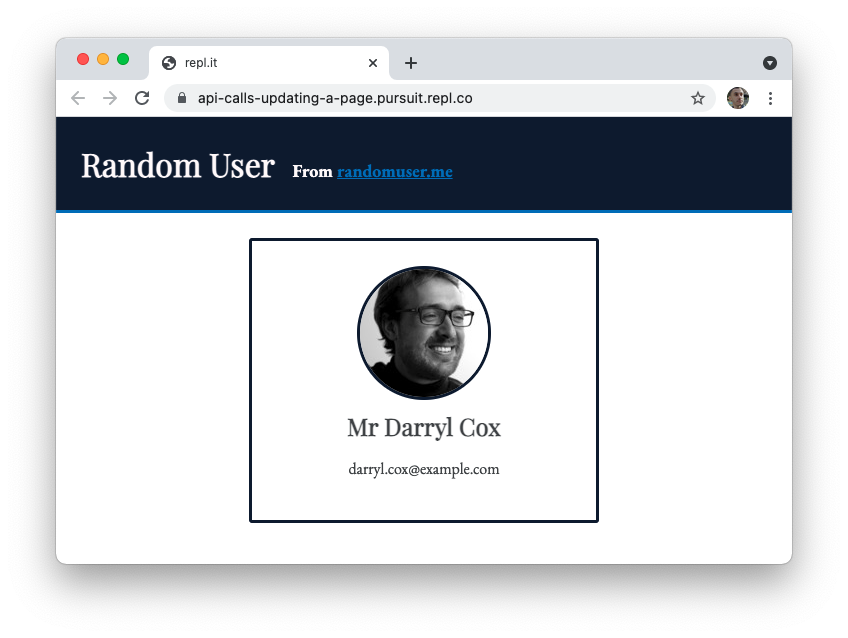

# API Calls with Promises and Fetch

To build an app that uses JSON APIs on the front-end, you'll need a way to connect to an external server and retrieve data from it. The browser's built-in `fetch()` function is one way to do so. This function allows you to make requests to external websites and does so using promises.

In this lesson, you'll learn how to use the `fetch()` function, which returns a promise with the desired data. Then, you'll see how you could integrate data into an HTML, CSS, and JavaScript web application.

## Learning objectives

By the end of this lesson, you should be able to:

- Describe what it means for code to run asynchronously.
- Identify what kind of operations usually lead to asynchronous code.
- Identify the purpose of promises.
- Distinguish between the three states of promises.
- Gracefully handle errors by showing a response to the user.
- Use the `fetch()` API to make GET requests to a public JSON API.
- Use the data from an API call to build a web application, including event listeners.

---

## Intro to Promises

A Promise is a proxy for a value not necessarily known when the promise is created. It allows you to associate handlers with an asynchronous action's eventual success value or failure reason. This lets asynchronous methods return values like synchronous methods: instead of immediately returning the final value, the asynchronous method returns a promise to supply the value at some point in the future.

Promises have three states:

- Pending
- Resolved
- Rejected

Pending means that the promise is still waiting for something to happen. Resolved means the expected behavior has occurred, the correct data is returned successfully, and finally, rejected means something went wrong in the promise.

## Fetch

While you can create a promise, many code libraries have promise objects for you to use. You don't often have to create a promise, but you only need to write the code that goes inside the `.then()` and the `.catch()`.

The browser has a function called `fetch()`. Fetch is also known as an API, though in this case, it is referring to the functionality provided by [`fetch()`](https://developer.mozilla.org/en-US/docs/Web/API/Fetch_API) rather than a service that returns data. It is important to note that Node.js does not have `fetch`, and you will get an error if you try to run this code in Node.js.

`Clone` this [repo](https://github.com/10-3-pursuit/api-promises-and-fetch-starter-code) so that you can code along.

Much like the `fs` module that retrieved data from a file, `.fetch()`retrieves data from places on the Internet.

The first argument for `fetch()` will be a URL. Use the fake user generator at https://randomuser.me

```js
// script.js

fetch("https://randomuser.me/api/?results=5");
```

Once the data is retrieved, _then_ do something with it:

```js
fetch("https://randomuser.me/api/?results=5").then((response) =>
  console.log(response)
);
```

When you open up the dev tools to see the console log, you will see the response object:


You must convert the response into JSON to get data for your app. _Then_ you can console log it.

```js
fetch("https://randomuser.me/api/?results=5")
  .then((response) => response.json())
  .then((data) => console.log(data));
```

Now you should be able to see data on the generated random user.


Notice that you must use dot notation to access the results array to see just the data.


## Dealing with errors

Errors are inevitable. Handling them gracefully improves both the user and developer experience.

Create an error by going to the wrong URL:

```js
fetch("https://randouser.me/api/?results=5")
  .then((response) => response.json())
  .then((data) => console.log(data.results));
```


Add a display error function to create an HTML template to append to the site. This will improve the user experience:

```js
function displayError(error) {
  const section = document.querySelector("section.error");
  section.style.display = "block";

  section.innerHTML = `
  <p>Something went wrong!</p>
  <p class="error-message">${error}</p>
  `;
}
```

Add a `.catch()` and replace your fetch with this fetch which has an incorrect URL.

```js
fetch("https://randuser.me/api/?results=5")
  .then((response) => response.json())
  .then((data) => console.log(data.results))
  .catch((error) => displayError(error));
```

Now your web page should show an error message:


## Incorporating data from `.fetch()` into a web page

Create a display card:

```js
function displayCard(person) {
  const { title, first, last } = person.name;
  const fullName = `${title} ${first} ${last}`;
  const peopleClass = document.querySelector(".people");

  peopleClass.innerHTML += `<section class="card">
  
  <h2>${fullName}</h2>
  <p>${person.email}</p>
  </section>`;
}
```

Notice that you are returning 5 users when making a fetch call. You want to display all 5 users.
In order to display these users, you can loop through the `results` array that was returned to you and call the `displayCard` function on each user.

Update the fetch call:

```js
fetch("https://randomuser.me/api/?results=5")
  .then((response) => response.json())
  .then((data) => data.results.forEach((user) => displayCard(user)))
  .catch((error) => displayError(error));
```

Now your page should work:



## Forms

### Adding a button

Add a `form` and `button` element inside the `main` element above `<section>`
The button should say 'Get Users'

In order to activate the button, you must add a `submit` event listener to your `main.js`
Remember how?

Now place your fetch call inside your event listener.

Now, in your browser, when you click the button, notice that your page populates with users.

### Retrieving the value from a form to use in the URL

Sometimes you want to search or ask for specific data.

You can retrieve values from a form to use in your API call.

Remember that our url to fetch is `https://randomuser.me/api/?results=5`?

What if we want to retrieve 10 users? or 15?

We can pass the value from our form to the url instead of hard coding the values.

In your HTML above the button tag, create a label section tag with 3 options. One option for 1, another for 2 and another for 3. Call the for, id, and name attributes in the section and label tags 'quantity'.

Now in your js can you remember how to retrieve the value sent by a form when submitted?

Replace the 5 in your URL with that value.

Now when you click the button, your page should add the number of users you chose to add.

## Alternative syntax for promises

As you look up documentation and search for support on Stack Overflow or other places, you may see an alternative syntax for promises that uses keywords `async` and `await`. This syntax will be covered at a later time.
